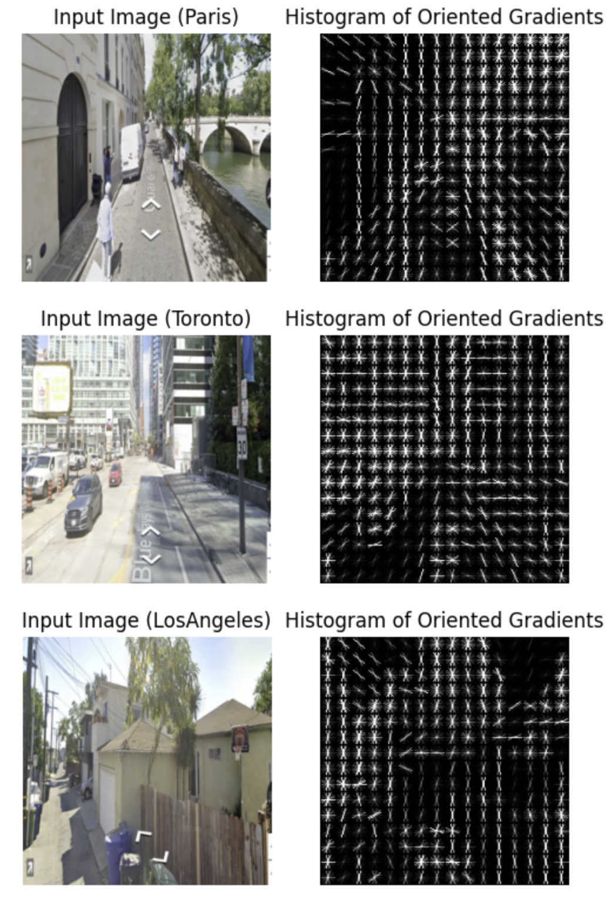

# GeoGuessrCV

[GeoGuessr](https://www.geoguessr.com/) is a popular web-based game that asks you to guess locations from Google Street View images. GeoGuessr professionals memorize many tricks to accurately guess their location.

To dumb things down a bit, can I use CV to differentiate between street views of Paris, Toronto and LA?

## Web Scraping

I used Selenium in Python to screen capture 200-300 images from each city with [Instant Street View](https://www.instantstreetview.com/), which provides Google Street View with location randomization. I manually filtered ~200 images based on quality, and reduced each image's dimension to 256x256.

## HOG + SVM

_SKLearn, SKImage_

Histogram of Oriented Gradient (HOG) is an image processing technique that 1) extracts gradients with Sobel filters, 2) subdivides these gradients into cells, 3) normalizes cells over larger blocks, and 4) compiles each cell into a histogram. HOG captures edges well and offers resiliency to geometric and photometric transformations. Below are some sample HOG transformations on my dataset:

Next, a Support Vector Machine (SVM) performs multi-class prediction using flattened HOG vectors. With GridSearchCV, I found the rbf kernel and a regularization parameter (C) of 10 to be the best hyperparameter values. This yields an accuracy of **68%** and a confusion matrix as follows:

Clearly, the model has the hardest time deciding between Toronto and Paris. This makes sense with the style of buildings we see!

## CNN

_PyTorch_, _MatPlotLib_

A Convolutional Neural Network (CNN) is a neural network that learns via filter optimization. Here, I built a custom 3-layer CNN using the following architecture (activations are batch normalized and reLU activated, although not shown):

The CNN is trained with mini-batch GD for 10 epochs. With relatively arbitrary architecture choice and hyperparameter initialization, the above model consistently performs with **~70% accuracy** on testing data. We can plot a sample learning curve below:

Let's also visualize the performance of the model (with parameters from the best-performing epoch) using a confusion matrix:

We can see that, surprisingly, it tends to predict street views of Paris as LA.

Finally, we can take a look at the weights of every convolution layer. Sometimes, this reveals insights into the exact patterns the model is trying to capture; in our case, it just shows the many diverse filters we are employing.

### Credits

Much of this work is inspired by what I learned from IBM's Introduction to Computer Vision and Image Processing course.
